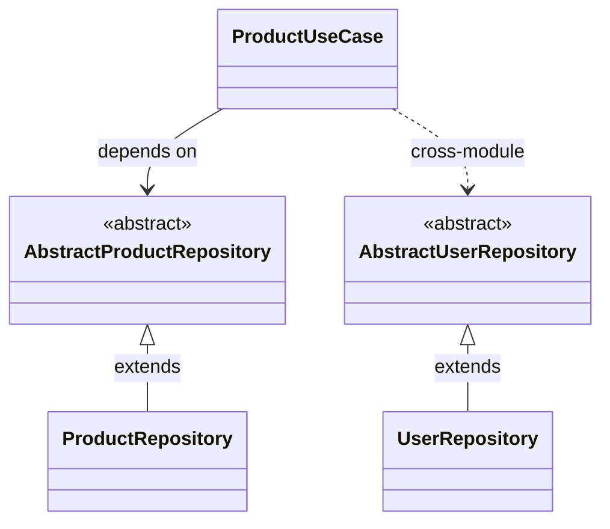

import { FileTree, Card, CardGrid, Badge, Tabs, TabItem } from '@astrojs/starlight/components';

<div style="display: flex; gap: 0.5rem; flex-wrap: wrap; margin: 1rem 0 2rem 0;">
  <Badge text="Abstract Classes" variant="tip" />
  <Badge text="Cross-Module DI" variant="success" />
  <Badge text="String Tokens" variant="note" />
</div>

:::tip[🎯 What You'll Learn]
Master **abstract classes** with IoC Arise in a real-world multi-module architecture:
- **Abstract Base Classes** - Define contracts without interfaces
- **String Token Resolution** - Resolve abstract classes by name
- **Cross-Module Dependencies** - ProductModule depends on UserModule
- **Implementation Flexibility** - Swap implementations easily
:::

## Project Structure

<FileTree>
- abstract-classes-example/
  - abstracts/
    - AbstractUserRepository.ts
    - AbstractProductRepository.ts
  - implementations/
    - UserRepository.ts
    - ProductRepository.ts
  - entities/
    - User.ts
    - Product.ts
  - use-cases/
    - UserUseCase.ts
    - ProductUseCase.ts
    - InternalProductNestedUseCase.ts
  - UserModule.gen.ts
  - ProductModule.gen.ts
  - container.gen.ts
  - ioc.config.json
</FileTree>

## Architecture Overview

:::note[🏗️ Two-Module System]
This example showcases a **User Module** and **Product Module** with cross-module dependencies. Products belong to users, so ProductModule needs access to UserModule's repository!
:::

<CardGrid>
  <Card title="👥 User Module" icon="user">
    **User Domain** - User management and authentication:
    
    • `AbstractUserRepository` (base class)  
    • `UserRepository` (concrete implementation)  
    • `UserUseCase` (business logic)  
    • `User` entity
  </Card>
  
  <Card title="📦 Product Module" icon="document">
    **Product Domain** - Product catalog with user ownership:
    
    • `AbstractProductRepository` (base class)  
    • `ProductRepository` (concrete implementation)  
    • `ProductUseCase` **depends on UserModule!**  
    • `Product` entity with `userId` reference
  </Card>
</CardGrid>

## Class Structure

Abstract classes provide both contracts and shared implementation:



**Key Pattern:**
- Abstract classes define contracts and provide shared `log()` implementation
- Concrete repositories extend abstract classes and implement abstract methods
- `ProductUseCase` depends on both abstract classes, including cross-module `AbstractUserRepository`

## Entity Definitions

<Tabs>
  <TabItem label="User Entity">

```typescript
// entities/User.ts
export interface User {
  id: string;
  name: string;
  email: string;
  createdAt: Date;
  updatedAt: Date;
}
```

  </TabItem>
  <TabItem label="Product Entity">

```typescript
// entities/Product.ts
export interface Product {
  id: string;
  name: string;
  description: string;
  price: number;
  userId: string; // Reference to the user who created the product
  createdAt: Date;
  updatedAt: Date;
}
```

**Note:** `userId` creates a relationship between products and users!

  </TabItem>
</Tabs>

## Abstract Base Classes

:::tip[🎨 Abstract Classes as Contracts]
Abstract classes provide **both interface contracts AND shared implementation**. Perfect for repositories with common logging, validation, or caching logic!
:::

<Tabs>
  <TabItem label="User Repository">

**AbstractUserRepository** - Base class for all user data access:

```typescript
// abstracts/AbstractUserRepository.ts
import { User } from '../entities/User';

export abstract class AbstractUserRepository {
  protected abstract tableName: string;
  
  // Abstract methods (must be implemented)
  abstract findById(id: string): Promise<User | null>;
  abstract findByEmail(email: string): Promise<User | null>;
  abstract save(user: User): Promise<User>;
  abstract delete(id: string): Promise<boolean>;
  
  // Shared implementation (inherited by all subclasses)
  protected log(message: string): void {
    console.log(`[${this.tableName}] ${message}`);
  }
}
```

**Benefits:**
• Defines contract (like an interface)  
• Provides shared `log()` method  
• All implementations get logging for free

  </TabItem>
  <TabItem label="Product Repository">

**AbstractProductRepository** - Base class for product data access:

```typescript
// abstracts/AbstractProductRepository.ts
import { Product } from '../entities/Product';

export abstract class AbstractProductRepository {
  protected abstract tableName: string;
  
  // Abstract methods
  abstract findById(id: string): Promise<Product | null>;
  abstract findByUserId(userId: string): Promise<Product[]>;
  abstract save(product: Product): Promise<Product>;
  abstract delete(id: string): Promise<boolean>;
  
  // Shared implementation
  protected log(message: string): void {
    console.log(`[${this.tableName}] ${message}`);
  }
}
```

**Note:** `findByUserId()` enables querying products by owner!

  </TabItem>
</Tabs>

## Concrete Implementations

<Tabs>
  <TabItem label="UserRepository">

```typescript
// implementations/UserRepository.ts
import { AbstractUserRepository } from '../abstracts/AbstractUserRepository';
import { User } from '../entities/User';

export class UserRepository extends AbstractUserRepository {
  protected tableName = 'users';
  private users: User[] = [];
  
  async findById(id: string): Promise<User | null> {
    this.log(`Finding user by ID: ${id}`); // ✅ Inherited log()
    return this.users.find(user => user.id === id) || null;
  }
  
  async findByEmail(email: string): Promise<User | null> {
    this.log(`Finding user by email: ${email}`);
    return this.users.find(user => user.email === email) || null;
  }
  
  async save(user: User): Promise<User> {
    this.log(`Saving user: ${user.name}`);
    const existingIndex = this.users.findIndex(u => u.id === user.id);
    
    if (existingIndex >= 0) {
      this.users[existingIndex] = { ...user, updatedAt: new Date() };
      return this.users[existingIndex];
    } else {
      const newUser = { ...user, createdAt: new Date(), updatedAt: new Date() };
      this.users.push(newUser);
      return newUser;
    }
  }
  
  async delete(id: string): Promise<boolean> {
    this.log(`Deleting user: ${id}`);
    const initialLength = this.users.length;
    this.users = this.users.filter(user => user.id !== id);
    return this.users.length < initialLength;
  }
}
```

**Extends** `AbstractUserRepository` and implements all abstract methods. Gets `log()` for free!

  </TabItem>
  <TabItem label="ProductRepository">

```typescript
// implementations/ProductRepository.ts
import { AbstractProductRepository } from '../abstracts/AbstractProductRepository';
import { Product } from '../entities/Product';

export class ProductRepository extends AbstractProductRepository {
  protected tableName = 'products';
  private products: Product[] = [];
  
  async findById(id: string): Promise<Product | null> {
    this.log(`Finding product by ID: ${id}`); // ✅ Inherited log()
    return this.products.find(product => product.id === id) || null;
  }
  
  async findByUserId(userId: string): Promise<Product[]> {
    this.log(`Finding products by user ID: ${userId}`);
    return this.products.filter(product => product.userId === userId);
  }
  
  async save(product: Product): Promise<Product> {
    this.log(`Saving product: ${product.name}`);
    const existingIndex = this.products.findIndex(p => p.id === product.id);
    
    if (existingIndex >= 0) {
      this.products[existingIndex] = { ...product, updatedAt: new Date() };
      return this.products[existingIndex];
    } else {
      const newProduct = { ...product, createdAt: new Date(), updatedAt: new Date() };
      this.products.push(newProduct);
      return newProduct;
    }
  }
  
  async delete(id: string): Promise<boolean> {
    this.log(`Deleting product: ${id}`);
    const initialLength = this.products.length;
    this.products = this.products.filter(product => product.id !== id);
    return this.products.length < initialLength;
  }
}
```

**Extends** `AbstractProductRepository` and adds product-specific query logic.

  </TabItem>
</Tabs>

## Use Cases with Cross-Module Dependencies

:::note[🔗 ProductUseCase Depends on UserModule]
**ProductUseCase** validates that users exist before creating products. This requires **AbstractUserRepository** from a different module!
:::

```typescript
// use-cases/ProductUseCase.ts
export class ProductUseCase {
  constructor(
    private productRepository: AbstractProductRepository, // Same module
    private userRepository: AbstractUserRepository,       // Different module!
    private internalNestedUseCase: InternalProductNestedUseCase
  ) {}

  async createProduct(
    productData: Omit<Product, 'id' | 'createdAt' | 'updatedAt'>
  ): Promise<Product> {
    // ✅ Validate user exists (cross-module validation!)
    const user = await this.userRepository.findById(productData.userId);
    if (!user) {
      throw new Error(`User with ID ${productData.userId} not found`);
    }

    const product: Product = {
      id: Math.random().toString(36).substr(2, 9),
      ...productData,
      createdAt: new Date(),
      updatedAt: new Date()
    };
    
    return await this.productRepository.save(product);
  }

  async getProductWithUser(productId: string) {
    const product = await this.productRepository.findById(productId);
    if (!product) return null;

    // ✅ Fetch user from different module
    const user = await this.userRepository.findById(product.userId);
    if (!user) {
      throw new Error(`User with ID ${product.userId} not found`);
    }

    return { product, user };
  }
  
  // ... other methods
}
```

**The Key:** ProductUseCase needs `AbstractUserRepository` which is registered in UserModule, but ProductUseCase is in ProductModule. IoC Arise resolves this automatically!

## Configuration

:::note[⚙️ Module Configuration]
Define which files belong to which module using glob patterns:
:::

```json
{
  "sourceDir": ".",
  "outputPath": "container.gen.ts",
  "modules": {
    "UserModule": ["**/**/*User*"],      // All files with "User" in name
    "ProductModule": ["**/**/*Product*"]  // All files with "Product" in name
  }
}
```

This groups files into logical modules that can depend on each other!

## Generated Container

:::tip[✨ One Command, Complete Setup]
Run `npx @notjustcoders/ioc-arise` and get modular DI with abstract class support:
:::

<Tabs>
  <TabItem label="Main Container">

```typescript
// container.gen.ts
import { Container } from '@notjustcoders/di-container';
import type { ContainerRegistry } from './container.gen.d';
import { userModule } from './modules/userModule.module';
import { productModule } from './modules/productModule.module';

export const container = new Container<ContainerRegistry>();

// ✅ Modules registered in correct order
container.registerModule(userModule);
container.registerModule(productModule);
```

Clean aggregation of all modules!

  </TabItem>
  <TabItem label="User Module">

```typescript
// modules/userModule.module.ts
import { ContainerModule, Lifecycle } from '@notjustcoders/di-container';
import { UserUseCase } from '../use-cases/UserUseCase';
import { UserRepository } from '../implementations/UserRepository';

export const userModule = new ContainerModule()
  .register(UserUseCase, { 
    useClass: UserUseCase, 
    dependencies: ['AbstractUserRepository'], // String token!
    lifecycle: Lifecycle.Singleton 
  })
  .register('AbstractUserRepository', { 
    useClass: UserRepository, // Concrete implementation
    lifecycle: Lifecycle.Singleton 
  });
```

**Key Point:** `'AbstractUserRepository'` is a **string token** that maps to `UserRepository`

  </TabItem>
  <TabItem label="Product Module">

```typescript
// modules/productModule.module.ts
import { ContainerModule, Lifecycle } from '@notjustcoders/di-container';
import { ProductUseCase } from '../use-cases/ProductUseCase';
import { InternalProductNestedUseCase } from '../use-cases/InternalProductNestedUseCase';
import { ProductRepository } from '../implementations/ProductRepository';

export const productModule = new ContainerModule()
  .register(ProductUseCase, { 
    useClass: ProductUseCase, 
    // ✅ Cross-module dependency detected!
    dependencies: [
      'AbstractProductRepository',  // Same module
      'AbstractUserRepository',     // Different module!
      InternalProductNestedUseCase  // Direct class
    ], 
    lifecycle: Lifecycle.Singleton 
  })
  .register(InternalProductNestedUseCase, { 
    useClass: InternalProductNestedUseCase, 
    dependencies: ['AbstractProductRepository'], 
    lifecycle: Lifecycle.Singleton 
  })
  .register('AbstractProductRepository', { 
    useClass: ProductRepository, 
    lifecycle: Lifecycle.Singleton 
  });
```

**Cross-Module Magic:** ProductModule accesses `'AbstractUserRepository'` from UserModule seamlessly!

  </TabItem>
</Tabs>

## Usage in Your Application

<Tabs>
  <TabItem label="Basic Usage">

```typescript
import { container } from './container.gen';

// ✅ Resolve by class constructor
const userUseCase = container.resolve(UserUseCase);
const productUseCase = container.resolve(ProductUseCase);

// Create a user
const user = await userUseCase.createUser({
  name: 'John Doe',
  email: 'john@example.com'
});

// Create product (validates user exists!)
const product = await productUseCase.createProduct({
  name: 'Awesome Product',
  description: 'A really great product',
  price: 99.99,
  userId: user.id  // ✅ Cross-module validation
});
```

  </TabItem>
  <TabItem label="String Token Resolution">

**Resolve abstract classes by string token:**

```typescript
import { container } from './container.gen';

// ✅ Resolve by abstract class name (string token)
const userRepo = container.resolve('AbstractUserRepository');
//    ^? UserRepository (concrete implementation)

const productRepo = container.resolve('AbstractProductRepository');
//    ^? ProductRepository (concrete implementation)

// Use repositories directly
const user = await userRepo.findById('user-123');
const products = await productRepo.findByUserId(user.id);
```

**Both return concrete implementations with full type safety!**

  </TabItem>
  <TabItem label="Complete Workflow">

```typescript
import { container } from './container.gen';

const userUseCase = container.resolve(UserUseCase);
const productUseCase = container.resolve(ProductUseCase);

// Step 1: Create users
const alice = await userUseCase.createUser({
  name: 'Alice Smith',
  email: 'alice@example.com'
});

const bob = await userUseCase.createUser({
  name: 'Bob Johnson',
  email: 'bob@example.com'
});

// Step 2: Create products for users
const product1 = await productUseCase.createProduct({
  name: 'Laptop',
  description: 'High-performance laptop',
  price: 1299.99,
  userId: alice.id
});

const product2 = await productUseCase.createProduct({
  name: 'Mouse',
  description: 'Wireless mouse',
  price: 29.99,
  userId: bob.id
});

// Step 3: Get product with user details (cross-module!)
const productWithUser = await productUseCase.getProductWithUser(product1.id);
console.log('Product:', productWithUser.product.name);
console.log('Owner:', productWithUser.user.name);

// Step 4: Get all products by user
const aliceProducts = await productUseCase.getProductsByUserId(alice.id);
console.log(`Alice has ${aliceProducts.length} products`);
```

  </TabItem>
</Tabs>

## Key Takeaways

<CardGrid>
  <Card title="🎨 Abstract Classes" icon="star">
    Use abstract classes for **both contracts AND shared implementation**. Perfect for repositories with common logic!
  </Card>
  <Card title="🔤 String Tokens" icon="document">
    Resolve abstract classes by name: `container.resolve('AbstractUserRepository')` - fully type-safe!
  </Card>
  <Card title="🔗 Cross-Module DI" icon="puzzle">
    ProductModule depends on UserModule seamlessly. IoC Arise handles all the wiring automatically.
  </Card>
  <Card title="🛡️ Type Safety" icon="seti:typescript">
    Full IntelliSense for both string tokens and direct class resolution. Compile-time validation!
  </Card>
  <Card title="🔄 Easy Swapping" icon="rocket">
    Change `UserRepository` to `SqlUserRepository` without touching use cases. True dependency inversion!
  </Card>
  <Card title="📦 Modular" icon="approve-check">
    Clean separation between domains. Each module is independently testable and maintainable.
  </Card>
</CardGrid>

## Abstract Classes vs Interfaces

<Tabs>
  <TabItem label="When to Use Abstract Classes">

**Use abstract classes when you need:**

```typescript
abstract class AbstractRepository<T> {
  // ✅ Shared implementation
  protected log(msg: string) {
    console.log(`[${this.tableName}] ${msg}`);
  }
  
  // ✅ Abstract methods (contract)
  abstract findById(id: string): Promise<T | null>;
  
  // ✅ Protected properties
  protected abstract tableName: string;
}
```

**Benefits:**
• Share common logic across implementations  
• Provide default behavior  
• Enforce property requirements  
• Use protected members

  </TabItem>
  <TabItem label="When to Use Interfaces">

**Use interfaces when you only need:**

```typescript
interface IRepository<T> {
  // ✅ Just the contract
  findById(id: string): Promise<T | null>;
  save(item: T): Promise<T>;
  delete(id: string): Promise<boolean>;
}
```

**Benefits:**
• Lighter weight (no implementation)  
• Multiple interface implementation  
• Simpler for pure contracts  
• Standard TypeScript pattern

  </TabItem>
</Tabs>

:::tip[🎯 Best Practice]
Use **abstract classes** when you have shared logic (logging, caching, validation).  
Use **interfaces** when you only need a contract.

IoC Arise supports both seamlessly with string token resolution!
:::