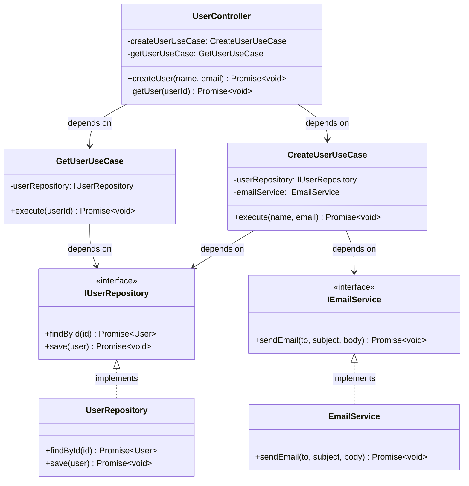

import { FileTree, Card, CardGrid, Badge, Tabs, TabItem } from '@astrojs/starlight/components';

<div style="display: flex; gap: 0.5rem; flex-wrap: wrap; margin: 1rem 0 2rem 0;">
  <Badge text="Clean Architecture" variant="tip" />
  <Badge text="Direct Class DI" variant="success" />
  <Badge text="No Interface Required" variant="note" />
</div>

:::tip[🎯 What You'll Learn]
Discover how IoC Arise handles **classes without interfaces** - perfect for Clean Architecture patterns:
- **Use Cases Without Interfaces** - Not every class needs an interface
- **Automatic Detection** - CLI includes classes used as dependencies
- **Dual Resolution** - Mix interface tokens and direct class resolution
- **Clean Architecture Support** - Controllers, Use Cases, and Services work seamlessly
:::

## Project Structure

<FileTree>
- use-cases-example/
  - ioc.config.json
  - container.gen.ts
  - repositories/
    - IUserRepository.ts
    - UserRepository.ts
  - services/
    - IEmailService.ts
    - EmailService.ts
    - IApplicationService.ts
    - ApplicationService.ts
  - use-cases/
    - CreateUserUseCase.ts
    - GetUserUseCase.ts
    - UserController.ts
</FileTree>

## The Problem IoC Arise Solves

:::note[🤔 Real-World Scenario]
In Clean Architecture, **use cases and controllers often don't need interfaces**. They're concrete implementations that orchestrate business logic. But how do you use them with dependency injection?

**IoC Arise automatically detects and includes these classes** - no extra configuration needed!
:::

<CardGrid>
  <Card title="✅ Interface-Based" icon="seti:typescript">
    **Repositories & Services** implement interfaces:
    
    • `IUserRepository` → `UserRepository`  
    • `IEmailService` → `EmailService`  
    • `IApplicationService` → `ApplicationService`
    
    Used via string tokens for flexibility
  </Card>
  
  <Card title="🎯 Direct Classes" icon="star">
    **Use Cases & Controllers** WITHOUT interfaces:
    
    • `CreateUserUseCase` (no interface)  
    • `GetUserUseCase` (no interface)  
    • `UserController` (no interface)
    
    Resolved directly by class constructor
  </Card>
</CardGrid>

## How It Works

:::tip[🔍 Intelligent Detection]
IoC Arise scans your codebase and automatically includes **any class that's used as a dependency** - even if it doesn't implement an interface!
:::

<Tabs>
  <TabItem label="What Gets Included">

**Classes WITH interfaces:**
```typescript
class UserRepository implements IUserRepository {}
// ✅ Included - implements interface
// ✅ Accessible via: container.resolve('IUserRepository')
```

**Classes WITHOUT interfaces (but used as dependencies):**
```typescript
class CreateUserUseCase {
  constructor(private repo: IUserRepository) {}
}
// ✅ Included - used by UserController
// ✅ Accessible via: container.resolve(CreateUserUseCase)
```

**Classes NOT used anywhere:**
```typescript
class UnusedUtility {}
// ❌ Not included - never used as dependency
```

  </TabItem>
  <TabItem label="Resolution Methods">

**Method 1: String Tokens (for interfaces)**
```typescript
// Works for classes implementing interfaces
const repo = container.resolve('IUserRepository');
const service = container.resolve('IEmailService');
```

**Method 2: Class Constructors (for direct classes)**
```typescript
// Works for classes without interfaces
const useCase = container.resolve(CreateUserUseCase);
const controller = container.resolve(UserController);
```

**Both are type-safe with full IntelliSense!**

  </TabItem>
</Tabs>

## Class Structure

This example demonstrates mixing interface-based and direct class dependencies:



**Key Pattern:**
- Repositories and services use interfaces (string token resolution)
- Use cases and controllers are direct classes (constructor resolution)
- Both resolution methods work seamlessly together

## Service Definitions

### User Entity and Repository Interface

```typescript
export interface IUserRepository {
  findById(id: string): Promise<User | null>;
  save(user: User): Promise<void>;
  findAll(): Promise<User[]>;
}

export interface User {
  id: string;
  name: string;
  email: string;
}
```

### Email Service Interface

```typescript
export interface IEmailService {
  sendEmail(to: string, subject: string, body: string): Promise<void>;
  sendWelcomeEmail(userEmail: string, userName: string): Promise<void>;
}
```

## Code Examples

<Tabs>
  <TabItem label="Use Case (No Interface)">

**CreateUserUseCase** - Pure business logic, no interface needed:

```typescript
import { IUserRepository } from '../repositories/IUserRepository';
import { IEmailService } from '../services/IEmailService';

// ✅ No interface - this is a concrete use case
export class CreateUserUseCase {
  constructor(
    private userRepository: IUserRepository,
    private emailService: IEmailService
  ) {}

  async execute(name: string, email: string): Promise<void> {
    const user = {
      id: Date.now().toString(),
      name,
      email
    };

    await this.userRepository.save(user);
    await this.emailService.sendWelcomeEmail(user.email, user.name);
    
    console.log(`User created: ${user.name} (${user.email})`);
  }
}
```

**Why no interface?** Use cases are specific business operations. They don't need abstraction - they ARE the implementation!

  </TabItem>
  <TabItem label="Another Use Case">

**GetUserUseCase** - Another concrete use case:

```typescript
import { IUserRepository } from '../repositories/IUserRepository';

export class GetUserUseCase {
  constructor(private userRepository: IUserRepository) {}

  async execute(userId: string): Promise<void> {
    const user = await this.userRepository.findById(userId);
    if (user) {
      console.log(`Found user: ${user.name} (${user.email})`);
    } else {
      console.log(`User with ID ${userId} not found`);
    }
  }
}
```

**Dependencies:** Uses `IUserRepository` (interface token) but doesn't implement an interface itself.

  </TabItem>
  <TabItem label="Controller">

**UserController** - Orchestrates use cases:

```typescript
import { CreateUserUseCase } from './CreateUserUseCase';
import { GetUserUseCase } from './GetUserUseCase';

// ✅ Controller uses use cases as direct dependencies
export class UserController {
  constructor(
    private createUserUseCase: CreateUserUseCase,
    private getUserUseCase: GetUserUseCase
  ) {}

  async createUser(name: string, email: string): Promise<void> {
    console.log('UserController: Creating user...');
    await this.createUserUseCase.execute(name, email);
  }

  async getUser(userId: string): Promise<void> {
    console.log('UserController: Getting user...');
    await this.getUserUseCase.execute(userId);
  }
}
```

**The Chain:**  
Controller → Use Cases → Services → Repositories

All wired automatically by IoC Arise!

  </TabItem>
</Tabs>

## Generated Container

```typescript
// container.gen.ts
import { Container, Lifecycle } from '@notjustcoders/di-container';
import type { ContainerRegistry } from './container.gen.d';
import { UserRepository } from './repositories/UserRepository';
import { UserService } from './services/UserService';
import { CreateUserUseCase } from './use-cases/CreateUserUseCase';
import { GetUserUseCase } from './use-cases/GetUserUseCase';
import { UserController } from './services/UserController';

export const container = new Container<ContainerRegistry>();

container.register('IUserRepository', {
  useClass: UserRepository,
  lifecycle: Lifecycle.Singleton,
});

container.register('IUserService', {
  useClass: UserService,
  dependencies: ['IUserRepository'],
  lifecycle: Lifecycle.Singleton,
});

container.register(CreateUserUseCase, {
  useClass: CreateUserUseCase,
  dependencies: ['IUserService'],
  lifecycle: Lifecycle.Singleton,
});

container.register(GetUserUseCase, {
  useClass: GetUserUseCase,
  dependencies: ['IUserService'],
  lifecycle: Lifecycle.Singleton,
});

container.register(UserController, {
  useClass: UserController,
  dependencies: [CreateUserUseCase, GetUserUseCase],
  lifecycle: Lifecycle.Singleton,
});
```

## Usage in Your Application

<Tabs>
  <TabItem label="Basic Usage">

```typescript
import { container } from './container.gen';

// ✅ Resolve by interface (string token)
const userRepo = container.resolve('IUserRepository');
//    ^? IUserRepository

// ✅ Resolve by class constructor (direct)
const controller = container.resolve(UserController);
//    ^? UserController

// Use the controller
await controller.createUser('John Doe', 'john@example.com');
await controller.getUser('user-123');
```

  </TabItem>
  <TabItem label="Complete Example">

```typescript
import { container } from './container.gen';

// Resolve all services
const userRepo = container.resolve('IUserRepository');
const emailService = container.resolve('IEmailService');
const createUseCase = container.resolve(CreateUserUseCase);
const getUserCase = container.resolve(GetUserUseCase);
const controller = container.resolve(UserController);

// Create multiple users
await controller.createUser('Alice Smith', 'alice@example.com');
await controller.createUser('Bob Johnson', 'bob@example.com');

// Retrieve users
await controller.getUser('1');
await controller.getUser('2');

// Direct use case usage
await createUseCase.execute('Charlie Brown', 'charlie@example.com');
await getUserCase.execute('3');
```

  </TabItem>
</Tabs>

## Configuration

```json
{
  "sourceDir": ".",
  "outputPath": "container.gen.ts",
  "interface": "I*.ts",
  "exclude": [
    "node_modules",
    "dist",
    "**/*.test.ts",
    "**/*.spec.ts"
  ]
}
```

## Key Takeaways

<CardGrid>
  <Card title="🏗️ Clean Architecture" icon="star">
    Perfect for **use cases and controllers** that don't need interface abstraction. Keep your domain pure!
  </Card>
  <Card title="🔍 Smart Detection" icon="magnifier">
    CLI automatically includes **any class used as a dependency** - no manual registration needed.
  </Card>
  <Card title="🎯 Dual Resolution" icon="puzzle">
    Mix **string tokens** (for interfaces) and **class constructors** (for direct classes) seamlessly.
  </Card>
  <Card title="🛡️ Type Safety" icon="seti:typescript">
    Full IntelliSense for both resolution methods. Compile-time safety guaranteed!
  </Card>
  <Card title="⚡ Zero Config" icon="rocket">
    No decorators, no manual registration, no config. Just write TypeScript classes!
  </Card>
  <Card title="✅ Validation" icon="approve-check">
    All dependencies validated at compile-time. Missing classes caught before runtime.
  </Card>
</CardGrid>

## When to Use Each Approach

<Tabs>
  <TabItem label="✅ Use Interfaces">

**Good for:**
- **Repositories** - Multiple implementations (InMemory, SQL, MongoDB)
- **Services** - Swap implementations (MockEmailService, RealEmailService)
- **External APIs** - Test with mocks
- **Infrastructure** - Database, logging, caching

```typescript
// ✅ Interface - allows multiple implementations
interface IUserRepository {
  findById(id: string): Promise<User>;
}

class InMemoryUserRepository implements IUserRepository {}
class MongoUserRepository implements IUserRepository {}
```

  </TabItem>
  <TabItem label="✅ Skip Interfaces">

**Good for:**
- **Use Cases** - Specific business operations
- **Controllers** - Request handlers
- **Command Handlers** - CQRS commands
- **Concrete Logic** - Only one implementation exists

```typescript
// ✅ No interface - this IS the implementation
class CreateUserUseCase {
  async execute(name: string) {
    // Specific business logic
  }
}
```

  </TabItem>
</Tabs>

:::tip[🚀 Best Practice]
Use interfaces where **flexibility is needed** (repositories, external services).  
Skip interfaces where **only one implementation exists** (use cases, controllers).

IoC Arise supports both seamlessly!
:::