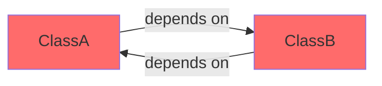
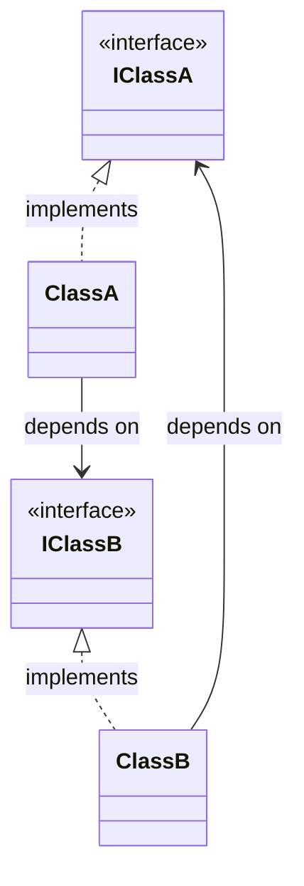

import { FileTree, Card, CardGrid, Badge, Tabs, TabItem } from '@astrojs/starlight/components';

<div style="display: flex; gap: 0.5rem; flex-wrap: wrap; margin: 1rem 0 2rem 0;">
  <Badge text="Error Detection" variant="caution" />
  <Badge text="Compile-Time" variant="success" />
  <Badge text="Best Practices" variant="tip" />
</div>

:::danger[⚠️ Critical Architecture Issue]
Circular dependencies are a common anti-pattern that can lead to:
- **Infinite loops** during instantiation
- **Stack overflow** errors at runtime
- **Difficult to maintain** code with tight coupling
- **Impossible to test** components in isolation

IoC Arise **detects these at compile-time** before they become runtime disasters!
:::

## The Problem

When two classes depend on each other, it creates an unsolvable dependency cycle:



The class structure shows the circular dependency:



**The Cycle:** `ClassA` → `IClassB` (resolves to `ClassB`) → `IClassA` (resolves to `ClassA`) → **impossible to instantiate!**

## Project Structure

<FileTree>
- circular-deps-classes/
  - interfaces/
    - IClassA.ts
    - IClassB.ts
  - services/
    - ClassA.ts
    - ClassB.ts
  - ioc.config.json
  - README.md
</FileTree>

## The Circular Dependency

<Tabs>
  <TabItem label="❌ ClassA (depends on B)">

```typescript
import { IClassB } from '../interfaces/IClassB';

export class ClassA implements IClassA {
  constructor(private classB: IClassB) {}
  //                          ^^^^^^^^
  //                     ClassA needs ClassB
  
  methodA(): string {
    return 'ClassA calling: ' + this.classB.methodB();
  }
}
```

  </TabItem>
  <TabItem label="❌ ClassB (depends on A)">

```typescript
import { IClassA } from '../interfaces/IClassA';

export class ClassB implements IClassB {
  constructor(private classA: IClassA) {}
  //                          ^^^^^^^^
  //                     ClassB needs ClassA
  
  methodB(): string {
    return 'ClassB calling: ' + this.classA.methodA();
  }
}
```

**The Problem:** ClassA can't be created without ClassB • ClassB can't be created without ClassA • **Impossible to instantiate either!**

  </TabItem>
  <TabItem label="Interfaces">

```typescript
export interface IClassA {
  methodA(): string;
}

export interface IClassB {
  methodB(): string;
}
```

  </TabItem>
</Tabs>

## IoC Arise Detection

:::tip[🔍 Automatic Detection]
When you run `npx @notjustcoders/ioc-arise`, the CLI analyzes your entire dependency graph and catches this immediately:
:::

```bash
❌ Error: Circular dependency detected in the dependency graph.

Circular dependency chain:
  ClassA → IClassB (ClassB) → IClassA (ClassA)

Classes involved:
  - ClassA (/path/to/services/ClassA.ts)
  - ClassB (/path/to/services/ClassB.ts)

⚠️  Fix: Refactor your code to break the circular dependency.
   Consider using events, callbacks, or dependency inversion.
```

**Why this matters:**
- ✅ **Caught at compile-time** - not at runtime when customers are using your app
- ✅ **Clear error message** - shows exact dependency chain
- ✅ **File locations** - know exactly which files to fix
- ✅ **Prevents deployment** - won't generate container with broken dependencies

## How to Fix Circular Dependencies

<CardGrid>
  <Card title="1️⃣ Extract Common Logic" icon="star">
    Create a third service/class that both can depend on without circular reference.
  </Card>
  <Card title="2️⃣ Use Events/Callbacks" icon="forward">
    Replace direct dependency with event-driven communication or callback pattern.
  </Card>
  <Card title="3️⃣ Dependency Inversion" icon="puzzle">
    Introduce an abstraction layer (interface) to break the direct coupling.
  </Card>
  <Card title="4️⃣ Lazy Resolution" icon="seti:config">
    Use lazy initialization or factory pattern to defer instantiation.
  </Card>
</CardGrid>

### Example Fix: Extract Common Service

<Tabs>
  <TabItem label="✅ Before (Circular)">

```typescript
// ❌ ClassA → ClassB → ClassA (circular!)
class ClassA {
  constructor(private classB: IClassB) {}
}

class ClassB {
  constructor(private classA: IClassA) {}
}
```

  </TabItem>
  <TabItem label="✅ After (Fixed)">

```typescript
// ✅ Both depend on SharedService (no cycle!)
class SharedService {
  doSomething(): string {
    return 'shared logic';
  }
}

class ClassA {
  constructor(private shared: SharedService) {}
}

class ClassB {
  constructor(private shared: SharedService) {}
}
```

**Dependency Graph:**
```
ClassA → SharedService
ClassB → SharedService
(No circular dependency!)
```

  </TabItem>
</Tabs>
