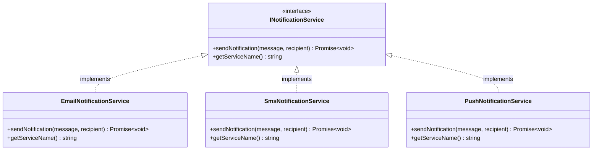

import { FileTree, Card, CardGrid, Badge, Tabs, TabItem } from '@astrojs/starlight/components';

<div style="display: flex; gap: 0.5rem; flex-wrap: wrap; margin: 1rem 0 2rem 0;">
  <Badge text="Error Detection" variant="caution" />
  <Badge text="Compile-Time" variant="success" />
  <Badge text="Ambiguity Prevention" variant="tip" />
</div>

:::danger[⚠️ Duplicate Interface Implementations]
This example demonstrates how IoC Arise handles the **error case** where multiple classes implement the same interface. You'll learn why this creates ambiguity for dependency injection and how IoC Arise provides clear error messages to help you resolve these conflicts.
:::

## Project Structure

<FileTree>
- duplicate-interfaces-example/
  - ioc.config.json
  - services/
    - INotificationService.ts
    - EmailNotificationService.ts
    - SmsNotificationService.ts
    - PushNotificationService.ts
</FileTree>

## The Problem

<CardGrid>
  <Card title="📋 Single Interface" icon="document">
    `INotificationService` defines the contract for notification services
  </Card>
  <Card title="🔀 Multiple Implementations" icon="puzzle">
    Three different classes implement the same interface
  </Card>
  <Card title="❓ Ambiguity Problem" icon="warning">
    Which implementation should be injected? Container can't decide!
  </Card>
  <Card title="✅ Error Detection" icon="approve-check">
    IoC Arise detects this and throws a clear error to prevent runtime issues
  </Card>
</CardGrid>

## Class Structure

Multiple classes implementing the same interface creates ambiguity:



**The Problem:** When resolving `INotificationService`, which implementation should the container use? All three classes implement the same interface, creating ambiguity.

## Code Examples

<Tabs>
  <TabItem label="Interface">

**Single interface, multiple implementations:**

```typescript
// services/INotificationService.ts
export interface INotificationService {
  sendNotification(message: string, recipient: string): Promise<void>;
  getServiceName(): string;
}
```

  </TabItem>
  <TabItem label="Email Service">

**EmailNotificationService** - email implementation:

```typescript
// services/EmailNotificationService.ts
import { INotificationService } from './INotificationService';

export class EmailNotificationService implements INotificationService {
  async sendNotification(message: string, recipient: string): Promise<void> {
    console.log(`Sending EMAIL notification to ${recipient}: ${message}`);
    await new Promise(resolve => setTimeout(resolve, 100));
  }

  getServiceName(): string {
    return 'Email Notification Service';
  }
}
```

  </TabItem>
  <TabItem label="SMS Service">

**SmsNotificationService** - SMS implementation:

```typescript
// services/SmsNotificationService.ts
import { INotificationService } from './INotificationService';

export class SmsNotificationService implements INotificationService {
  async sendNotification(message: string, recipient: string): Promise<void> {
    console.log(`Sending SMS notification to ${recipient}: ${message}`);
    await new Promise(resolve => setTimeout(resolve, 50));
  }

  getServiceName(): string {
    return 'SMS Notification Service';
  }
}
```

  </TabItem>
  <TabItem label="Push Service">

**PushNotificationService** - push notification implementation:

```typescript
// services/PushNotificationService.ts
import { INotificationService } from './INotificationService';

export class PushNotificationService implements INotificationService {
  async sendNotification(message: string, recipient: string): Promise<void> {
    console.log(`Sending PUSH notification to ${recipient}: ${message}`);
    await new Promise(resolve => setTimeout(resolve, 25));
  }

  getServiceName(): string {
    return 'Push Notification Service';
  }
}
```

  </TabItem>
</Tabs>

## IoC Arise Detection

:::tip[🔍 Automatic Detection]
When you run `npx @notjustcoders/ioc-arise`, the CLI detects duplicate interface implementations immediately:
:::

```bash
❌ Error: Interface 'INotificationService' is implemented by multiple classes:
  - EmailNotificationService (/path/to/services/EmailNotificationService.ts)
  - SmsNotificationService (/path/to/services/SmsNotificationService.ts)
  - PushNotificationService (/path/to/services/PushNotificationService.ts)

Multiple classes implement the same interface(s): INotificationService. 
Each interface should only be implemented by one class for proper dependency injection.
```

**Why this matters:**
- ✅ **Caught at compile-time** - prevents ambiguous dependency injection
- ✅ **Clear error message** - shows all duplicate implementations with file paths
- ✅ **Prevents deployment** - won't generate container with ambiguous dependencies
- ✅ **Architectural guidance** - helps identify design issues early

## Why This Happens

:::note[💡 Single Implementation Principle]
IoC Arise follows the principle that each interface should have **exactly one implementation** for dependency injection to work correctly. When multiple classes implement the same interface, the container doesn't know which one to inject.
:::

## How to Fix

<CardGrid>
  <Card title="1️⃣ Specific Interfaces" icon="star">
    Create specific interfaces for each implementation (recommended).
  </Card>
  <Card title="2️⃣ Factory Pattern" icon="puzzle">
    Use a factory class that decides which implementation to use.
  </Card>
  <Card title="3️⃣ Module Separation" icon="folder">
    Organize implementations into different modules with different names.
  </Card>
</CardGrid>

### Solution Examples

<Tabs>
  <TabItem label="✅ Specific Interfaces (Recommended)">

**Create specific interfaces for each implementation:**

```typescript
// Base interface
export interface INotificationService {
  sendNotification(message: string, recipient: string): Promise<void>;
  getServiceName(): string;
}

// Specific interfaces
export interface IEmailNotificationService extends INotificationService {}
export interface ISmsNotificationService extends INotificationService {}
export interface IPushNotificationService extends INotificationService {}

// Implementations
export class EmailNotificationService implements IEmailNotificationService {
  // ... implementation
}

export class SmsNotificationService implements ISmsNotificationService {
  // ... implementation
}

export class PushNotificationService implements IPushNotificationService {
  // ... implementation
}
```

**Benefits:**
• Each interface has one implementation  
• Clear separation of concerns  
• Type-safe resolution  
• Easy to extend

  </TabItem>
  <TabItem label="🏭 Factory Pattern">

**Use a factory to create the right implementation:**

```typescript
export interface INotificationFactory {
  createEmailService(): INotificationService;
  createSmsService(): INotificationService;
  createPushService(): INotificationService;
}

export class NotificationFactory implements INotificationFactory {
  createEmailService(): INotificationService {
    return new EmailNotificationService();
  }
  
  createSmsService(): INotificationService {
    return new SmsNotificationService();
  }
  
  createPushService(): INotificationService {
    return new PushNotificationService();
  }
}
```

**Benefits:**
• Centralized creation logic  
• Can add selection logic  
• Easy to test

  </TabItem>
</Tabs>

## Configuration

:::note[⚙️ Standard Configuration]
No special configuration needed - duplicate detection works automatically!
:::

```json
{
  "sourceDir": ".",
  "outputPath": "container.gen.ts",
  "interface": "I*.ts"
}
```

**What happens:**
• Scans all classes and detects interface implementations  
• Identifies duplicate implementations  
• Throws clear error with file paths  
• Stops generation to prevent ambiguous DI

## Usage After Fix

**Once you've fixed the duplicates (using specific interfaces):**

```typescript
import { container } from './container.gen';

// ✅ Each interface has one implementation - no ambiguity!
const emailService = container.resolve('IEmailNotificationService');
const smsService = container.resolve('ISmsNotificationService');
const pushService = container.resolve('IPushNotificationService');

// Use all services together
export class NotificationManager {
  constructor(
    private emailService: IEmailNotificationService,
    private smsService: ISmsNotificationService,
    private pushService: IPushNotificationService
  ) {}
  
  async sendToAll(message: string, recipient: string) {
    await Promise.all([
      this.emailService.sendNotification(message, recipient),
      this.smsService.sendNotification(message, recipient),
      this.pushService.sendNotification(message, recipient)
    ]);
  }
}
```

**Full type safety and no ambiguity!**

## Key Takeaways

<CardGrid>
  <Card title="🛡️ Error Prevention" icon="approve-check">
    Catches ambiguous dependency injection at build time, not runtime!
  </Card>
  <Card title="📊 Clear Error Messages" icon="document">
    Detailed reporting of which classes cause conflicts with file paths.
  </Card>
  <Card title="🏗️ Architecture Validation" icon="seti:config">
    Ensures clean dependency injection patterns from the start.
  </Card>
  <Card title="🛡️ Type Safety" icon="seti:typescript">
    Maintains full TypeScript support with proper interface contracts.
  </Card>
  <Card title="💡 Development Guidance" icon="star">
    Provides clear paths to resolve conflicts (specific interfaces, factories, etc.).
  </Card>
  <Card title="✅ Best Practices" icon="rocket">
    Guides you toward better architectural decisions early in development!
  </Card>
</CardGrid>

:::tip[🚀 Early Detection Saves Time]
IoC Arise's strict validation prevents runtime ambiguity and guides you toward better architectural decisions by catching interface conflicts early in the development process!
:::