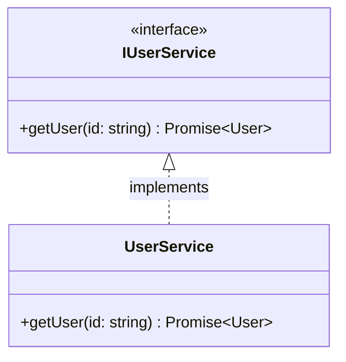

import { Tabs, TabItem, Steps, Card, CardGrid, Badge } from '@astrojs/starlight/components';

<div style="display: flex; gap: 0.5rem; flex-wrap: wrap; margin: 1rem 0 2rem 0;">
  <Badge text="Zero Decorators" variant="success" />
  <Badge text="Type-Safe" variant="tip" />
  <Badge text="Auto-Generated" variant="note" />
</div>

## Overview

:::tip[🎯 Two-Package System]
IoC Arise provides maximum flexibility through a clean separation of concerns:
- **CLI Tool** (`@notjustcoders/ioc-arise`) - Analyzes and generates code
- **Runtime Container** (`@notjustcoders/di-container`) - Executes dependency injection
:::

**IoC-Arise is a complete dependency injection solution for TypeScript:**

<CardGrid>
  <Card title="📦 @notjustcoders/ioc-arise" icon="seti:npm">
    CLI tool for analyzing code and generating containers. AST-powered analysis detects dependencies automatically.
  </Card>
  <Card title="⚡ @notjustcoders/di-container" icon="rocket">
    Lightweight runtime DI container (~4KB, zero decorators). Use standalone or with generated code.
  </Card>
</CardGrid>

## Installation

<Tabs>
  <TabItem label="CLI Only (Recommended)">
    ```bash
    # Install CLI globally or as dev dependency
    npm install -D @notjustcoders/ioc-arise
    
    # The CLI will automatically add @notjustcoders/di-container as a dependency
    ```
  </TabItem>
  <TabItem label="Both Packages">
    ```bash
    # If you want to install both explicitly
    npm install -D @notjustcoders/ioc-arise
    npm install @notjustcoders/di-container
    ```
  </TabItem>
  <TabItem label="Runtime Only">
    ```bash
    # If you only want the DI container (manual setup)
    npm install @notjustcoders/di-container
    ```
  </TabItem>
</Tabs>

## Quick Start

<Steps>

1. **Install the CLI**

   ```bash
   npm install -D @notjustcoders/ioc-arise
   ```

2. **Create Your Services**

   ```typescript
   // services/IUserService.ts
   export interface IUserService {
     getUser(id: string): Promise<User>;
   }

   // services/UserService.ts
   export class UserService implements IUserService {
     async getUser(id: string): Promise<User> {
       // Implementation
     }
   }
   ```

3. **Generate Container**

   ```bash
   npx @notjustcoders/ioc-arise generate
   ```

4. **Use the Container**

   ```typescript
   import { container } from "./container.gen";

   const userService = container.resolve('IUserService');
   const user = await userService.getUser('123');
   ```

</Steps>

## Class Structure

The basic dependency injection pattern uses interfaces and their implementations:



**Key Points:**
- `IUserService` defines the contract (interface)
- `UserService` implements the interface
- The container resolves `IUserService` to `UserService` automatically

## Generated Code

:::note[✨ What Gets Generated]
The CLI automatically creates production-ready code with full TypeScript support:
:::

<Tabs>
  <TabItem label="Main Container">
  
  **`container.gen.ts`** - Ready-to-use container instance
  
```typescript
import { Container } from '@notjustcoders/di-container';
import type { ContainerRegistry } from './container.gen.d';
import { userModule } from './modules/userModule.module';

export const container = new Container<ContainerRegistry>();

container.registerModule(userModule);
```

**Benefits:** ✅ All imports auto-generated • ✅ Modules automatically registered • ✅ Type-safe with `ContainerRegistry` • ✅ Full IntelliSense support

  </TabItem>
  <TabItem label="Type Declarations">
  
  **`container.gen.d.ts`** - Full IntelliSense support
  
```typescript
import type { IUserService } from './services/IUserService';

export interface ContainerRegistry {
  'IUserService': IUserService;
  // ... all your interfaces mapped
}
```

**Usage with type safety:**

```typescript
import { container } from './container.gen';

const service = container.resolve('IUserService');
//    ^? IUserService - Full type safety!
```

**Benefits:** ✅ Autocomplete for all tokens • ✅ Compile-time type checking • ✅ IDE refactoring support • ✅ Type-safe resolution

  </TabItem>
  <TabItem label="Module Files">
  
  **`modules/userModule.module.ts`** - Organized registrations
  
```typescript
import { ContainerModule, Lifecycle } from '@notjustcoders/di-container';
import { UserService } from '../services/UserService';

export const userModule = new ContainerModule()
  .register('IUserService', {
    useClass: UserService,
    dependencies: ['IUserRepository'],
    lifecycle: Lifecycle.Singleton
  });
```

**Benefits:** ✅ Dependencies auto-detected • ✅ Lifecycle scopes respected • ✅ Clean module separation

  </TabItem>
</Tabs>

## Manual Usage (Without CLI)

:::caution[⚙️ Advanced Usage]
You can use `@notjustcoders/di-container` standalone if you prefer manual configuration:
:::

```typescript
import { Container, Lifecycle } from '@notjustcoders/di-container';

// Define registry for type safety
interface ContainerRegistry {
  'IUserService': IUserService;
  'IUserRepository': IUserRepository;
}

const container = new Container<ContainerRegistry>();

// Manual registration (no code generation)
container.register('IUserService', {
  useClass: UserService,
  dependencies: ['IUserRepository'],
  lifecycle: Lifecycle.Singleton
});

// Full type safety
const service = container.resolve('IUserService');
//    ^? IUserService
```

**When to use manual setup:**
- ✅ Small projects with few dependencies
- ✅ Dynamic service registration at runtime
- ✅ Full control over container configuration

**When to use CLI (recommended):**
- ✅ Medium to large projects
- ✅ Static dependency graphs
- ✅ Want compile-time validation

See the [`@notjustcoders/di-container` documentation](https://www.npmjs.com/package/@notjustcoders/di-container) for more details.

## Module Configuration

Organize your code into logical modules using `ioc.config.json`:

```json
{
  "sourceDir": "./src",
  "outputPath": "./src/container.gen.ts",
  "interface": "I*.ts",
  "modules": {
    "UserModule": ["user/**"],
    "TodoModule": ["todo/**"]
  }
}
```

This will generate separate module files:

```
src/
├── container.gen.ts          # Main container
├── container.gen.d.ts        # Type declarations
└── modules/
    ├── userModule.module.ts  # User module registrations
    └── todoModule.module.ts  # Todo module registrations
```

Access services using string tokens:

```typescript
const userService = container.resolve('IUserService');
const todoService = container.resolve('ITodoService');
```

## Lifecycle Scopes

:::tip[🔄 Smart Lifecycle Management]
Control instance creation with simple JSDoc annotations. The CLI detects these automatically!
:::

<Tabs>
  <TabItem label="Singleton (Default)">
  
  **One shared instance** across the entire application:

```typescript
/**
 * @scope singleton
 */
export class UserRepository implements IUserRepository {
  // ✅ Same instance reused everywhere
  // ✅ Good for: Databases, configs, caches
  // ✅ Better performance (one instantiation)
}
```

**Use Cases:** Database connections • Configuration services • Caching layers • Stateful services

  </TabItem>
  <TabItem label="Transient">
  
  **New instance** created every time:

```typescript
/**
 * @scope transient
 */
export class RequestLogger implements ILogger {
  // ✅ New instance per resolve
  // ✅ Good for: Request handlers, loggers
  // ✅ Isolated state per call
}
```

**Use Cases:** HTTP request handlers • Command processors • Per-request loggers • Stateless operations

  </TabItem>
  <TabItem label="No Annotation">
  
  **Defaults to Singleton** if no annotation:

```typescript
export class UserService implements IUserService {
  // Automatically treated as singleton
  // Same as adding @scope singleton
}
```

**Best Practice:**
Always be explicit with `@scope` annotations for clarity!

  </TabItem>
</Tabs>

## Configuration Options

Create an `ioc.config.json` file in your project root:

```json
{
  "sourceDir": "./src",           // Source directory to analyze
  "outputPath": "./src/container.gen.ts",  // Output file path
  "interface": "I*.ts",            // Interface file pattern
  "exclude": [                     // Files to exclude
    "node_modules",
    "dist",
    "**/*.test.ts"
  ],
  "modules": {                     // Optional module grouping
    "CoreModule": ["core/**"],
    "UserModule": ["user/**"],
    "TodoModule": ["todo/**"]
  }
}
```

## Next Steps

<CardGrid stagger>
  <Card title="📚 Examples" icon="open-book">
    Explore [real-world examples](/examples/minimal-todo/) including Clean Architecture, modules, and use cases.
  </Card>
  <Card title="🎯 Core Features" icon="star">
    Learn about [abstract classes](/core-features/abstract-classes-example/), [scopes](/core-features/scope-example/), and [modules](/core-features/simple-modules/).
  </Card>
  <Card title="⚠️ Error Detection" icon="warning">
    Understand how IoC Arise catches [circular dependencies](/error-detection/circular-deps-classes/) and [other issues](/error-detection/duplicate-interfaces-example/).
  </Card>
  <Card title="📖 Reference" icon="document">
    Check the [CLI Reference](/reference/cli-reference/) and [Configuration](/reference/configuration/) for complete documentation.
  </Card>
</CardGrid>

:::note[💡 Need Help?]
- Join our [Discord community](https://discord.gg/your-discord-invite)
- Report issues on [GitHub](https://github.com/stormsidali2001/ioc-arise/issues)
- Check the [npm package](https://www.npmjs.com/package/@notjustcoders/di-container)
:::
